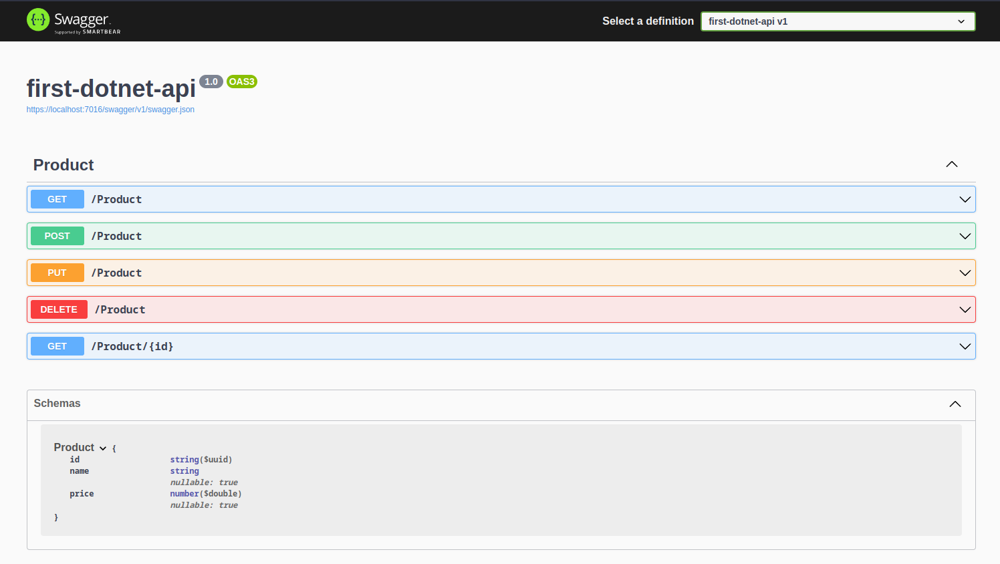

# Dotnet app

A simple app to testing dotnet 6

---

## How to run this app

First install dotnet 6 sdk

```sh
wget https://packages.microsoft.com/config/ubuntu/22.04/packages-microsoft-prod.deb -O packages-microsoft-prod.deb
sudo dpkg -i packages-microsoft-prod.deb
rm packages-microsoft-prod.deb
```

```sh
sudo apt-get update && \
sudo apt-get install -y dotnet-sdk-6.0

```


Build the app

```sh
dotnet build

```

Run the app

```sh
dotnet run --environment Development

```

Open swagger on `https://localhost:7016/swagger/index.html`


